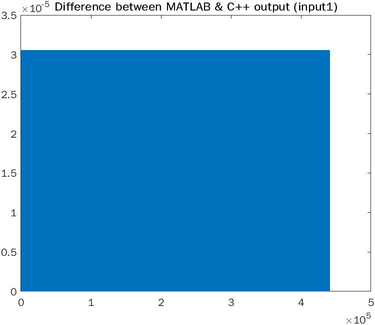

## Test 1:

To generate `output1.wav`:
```bash
bin/MUSI6106Exec input1.wav output1.wav fir 0.00022675736961451248 0.5
```

(Parameters match the MATLAB version; gain of 0.5, delay of 10 samples - in this case at 44.1kHz.)

Difference between `output1.wav` and `output1_matlab.wav` (x-axis is time in samples):



## Test 2:

To generate `output2.wav`:
```bash
bin/MUSI6106Exec input2.wav output2.wav iir 0.00022675736961451248 0.5
```

Difference between `output2.wav` and `output2_matlab.wav` (x-axis is time in samples):


