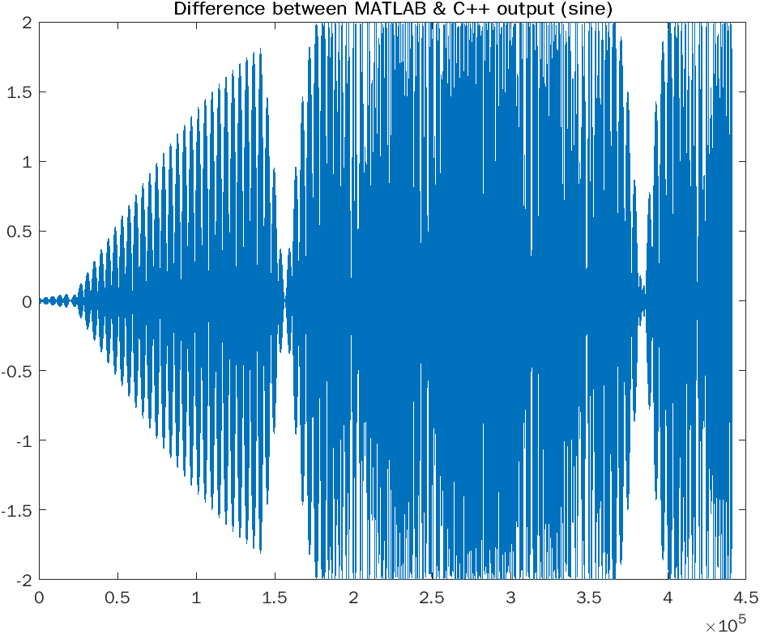
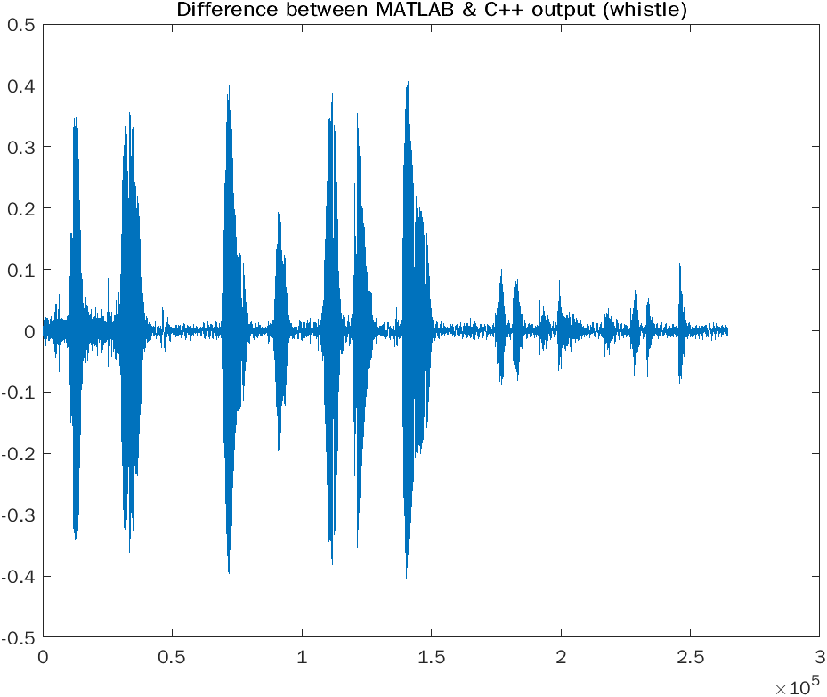
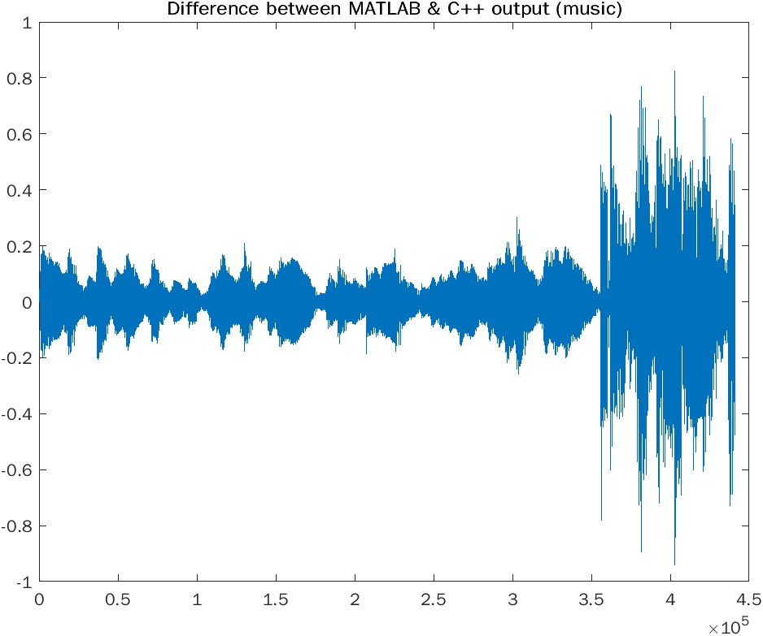

Tests executed via:

```bash
bin/MUSI6106Exec input_sine.wav output_sine.wav 5 0.01
bin/MUSI6106Exec input_whistle.wav output_whistle.wav 10 0.001
bin/MUSI6106Exec input_music.wav output_music.wav 50 0.05
```






